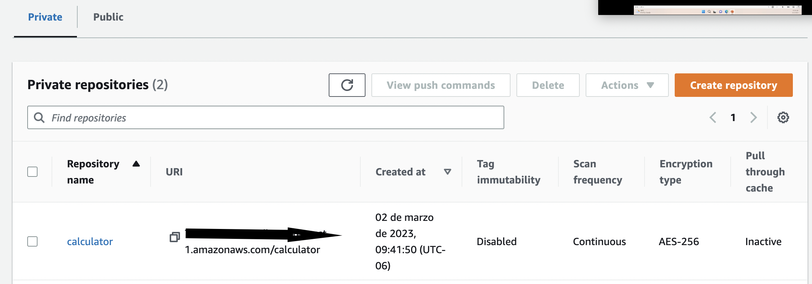

This is an example about how to push your Docker Image to ECR and the create a namespace "calculator" for Deployment on EKS
 
 
 Service of calculator running
 

user port-forward in order to validate the application.

Screen shoot of Calculator working into the browser.

